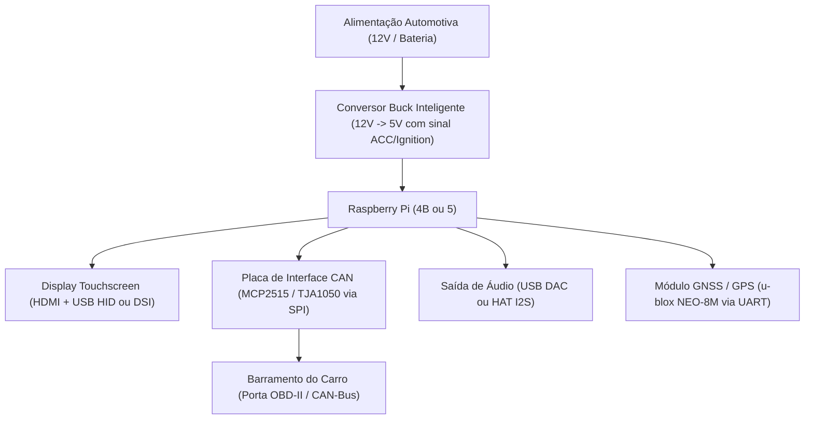
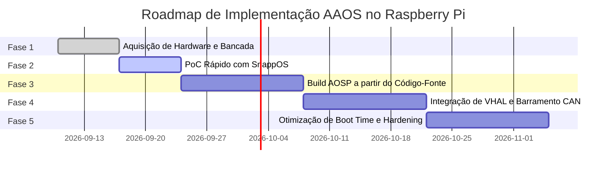

# Roadmap: Android Automotive OS (AAOS) em Raspberry Pi

Este documento apresenta um plano técnico e arquitetural estruturado para migrar a experiência desenvolvida no **Cuttlefish (emulador)** para hardware embarcado real utilizando **Raspberry Pi** (focado no **Raspberry Pi 4 Model B** e **Raspberry Pi 5**).

---

## 1. Visão Geral e Comparativo de Hardware

| Característica | Raspberry Pi 4 Model B | Raspberry Pi 5 |
|---|---|---|
| **SoC** | Broadcom BCM2711 (Quad Cortex-A72 @ 1.8 GHz) | Broadcom BCM2712 (Quad Cortex-A76 @ 2.4 GHz) |
| **GPU** | VideoCore VI (V3D 4.2, OpenGL ES 3.1) | VideoCore VII (V3D 7.1, OpenGL ES 3.1, Vulkan 1.2) |
| **Memória RAM** | 4 GB ou 8 GB LPDDR4-3200 | 4 GB ou 8 GB LPDDR4X-4266 |
| **Armazenamento** | MicroSD (UHS-I) / USB 3.0 SSD | MicroSD / **PCIe 2.0/3.0 M.2 NVMe SSD** |
| **Saídas de Vídeo** | 2x Micro-HDMI (até 4K60) + 1x DSI (2-lane) | 2x Micro-HDMI (até 4K60) + 2x MIPI DSI/CSI (4-lane) |
| **Maturidade de AAOS** | **Excelente** (Suporte consolidado via SnappOS e Raspberry-Vanilla) | **Em evolução** (AOSP upstream incorporando suporte a BCM2712) |
| **Recomendação** | **Ideal para PoC imediato** e desenvolvimento estável. | **Ideal para alta performance**, boot ultrarrápido via NVMe e multitelas. |

---

## 2. Arquitetura de Hardware e Lista de Componentes (BOM)

Para montar uma bancada automotiva (*Automotive Testbench*) funcional, os seguintes componentes são recomendados:



### Componentes Chave:
1. **Computador Embarcado:** Raspberry Pi 4B (8GB recomendado) ou Raspberry Pi 5 (8GB).
2. **Armazenamento:**
   - Para RPi 4: Cartão MicroSD SanDisk Extreme PRO A2 ou SSD USB 3.0 externo.
   - Para RPi 5: HAT M.2 NVMe + SSD NVMe (garante leitura de 400+ MB/s para boot rápido).
3. **Display e Touchscreen:**
   - **Opção A (DSI):** Display Oficial Raspberry Pi 7" Touchscreen (ou Waveshare 7"/10.1" DSI). Vantagem: usa cabo flat DSI e touch nativo I2C sem ocupar portas USB.
   - **Opção B (HDMI + USB):** Telas automotivas de 8" a 12.3" ultrawide via HDMI com controlador de toque capacitivo USB (Goodix GT911 ou FT5406).
4. **Interface Veicular (CAN-Bus):**
   - Módulo **MCP2515 SPI com transceiver TJA1050** ou HAT **Waveshare 2-CH CAN FD**.
   - Conexão direta aos pinos SPI do GPIO do Raspberry Pi (`GPIO 8, 9, 10, 11, 25`).
5. **Gerenciamento de Energia Automotivo:**
   - Conversores DC-DC com proteção contra transientes veiculares (*load dump* e partida do motor: queda de 12V para 6V temporária).
   - Módulo com leitura do sinal **ACC / Chave de Ignição (KL15)** para acionar desligamento seguro (*graceful shutdown*) do Android ao desligar o carro.

---

## 3. Comparativo de Abordagens de Software

Existem duas rotas principais para rodar Android Automotive no Raspberry Pi:

| Abordagem | Vantagens | Desvantagens | Quando Usar |
|---|---|---|---|
| **1. SnappAutomotive (SnappOS)** | • Imagens prontas para gravar no cartão SD.<br>• Launcher automotivo proprietário refinado.<br>• Touch e áudio pré-configurados para RPi 4.<br>• Suporte ativo da comunidade automotiva. | • Código de personalização do launcher é fechado/semiproprietário.<br>• Menos flexibilidade para alterar componentes de baixo nível do AOSP. | **Fase de validação rápida (PoC)** de UX e compatibilidade de hardware em menos de 1 hora. |
| **2. Vanilla AOSP (Raspberry-Vanilla / GloDroid)** | • 100% Open Source.<br>• Código-fonte AOSP completo acessível.<br>• Liberdade total para compilar VHAL personalizado, adicionar módulos de kernel e drivers de hardware customizados. | • Exige máquina de build potente (Ubuntu com 32GB+ RAM, 300GB+ SSD e 12+ cores).<br>• Tempo de compilação inicial de 2 a 5 horas. | **Desenvolvimento avançado**, engenharia de VHAL real, integração CAN-bus e produção. |

---

## 4. Roadmap de Implementação em 5 Fases



### Fase 1: Aquisição e Montagem da Bancada de Testes
- [ ] Obter Raspberry Pi 4B (ou 5) de 8GB com dissipador ativo e ventoinha (essencial para sustentar a GPU em rendering 3D contínuo).
- [ ] Montar o display touchscreen e testar inicialização com Raspberry Pi OS padrão para certificar o funcionamento do toque e da saída de vídeo.
- [ ] Montar circuito de bancada com fonte ajustável 12V -> 5V regulada.

### Fase 2: Prova de Conceito (PoC) com SnappOS (Zero-Compilation)
- [ ] Baixar a imagem pré-compilada mais recente do SnappOS para Raspberry Pi 4 em: [snappautomotive.io](https://snappautomotive.io/).
- [ ] Gravar a imagem no MicroSD utilizando `Raspberry Pi Imager` ou `balenaEtcher`.
- [ ] Ajustar o arquivo `config.txt` na partição de boot para a resolução nativa do seu display:
  ```ini
  # Exemplo para forçar resolução HDMI 1080p
  hdmi_group=2
  hdmi_mode=82
  dtoverlay=vc4-kms-v3d
  ```
- [ ] Conectar via ADB pela rede (Wi-Fi ou cabo Ethernet):
  ```bash
  adb connect <IP_DO_RASPBERRY_PI>:5555
  adb shell dumpsys car_service
  ```
- [ ] Validar áudio, multitouch, Bluetooth e fluidez da interface.

### Fase 3: Ambiente de Compilação AOSP Customizado
- [ ] Configurar máquina host com Ubuntu 22.04/24.04, ferramentas de build (`repo`, `git`, `python3`, `openjdk-17-jdk`, `bison`, `flex`).
- [ ] Clonar os manifests do projeto Raspberry-Vanilla (branch correspondente a Android 13 ou 14):
  ```bash
  mkdir -p ~/aosp-rpi && cd ~/aosp-rpi
  repo init -u https://android.googlesource.com/platform/manifest -b android-14.0.0_rXX
  git clone https://github.com/raspberry-vanilla/android_local_manifest .repo/local_manifests
  repo sync -c -j$(nproc) --no-clone-bundle --no-tags
  ```
- [ ] Selecionar target automotivo do RPi:
  ```bash
  source build/envsetup.sh
  lunch rpi4_auto-userdebug
  make -j$(nproc)
  ```
- [ ] Gerar as imagens de partição (`boot.img`, `system.img`, `vendor.img`) e gravar no dispositivo de armazenamento.

### Fase 4: Integração de Hardware Real com VHAL (CAN-Bus)
- [ ] Habilitar o driver SPI do MCP2515 no arquivo `config.txt`:
  ```ini
  dtparam=spi=on
  dtoverlay=mcp2515-can0,oscillator=16000000,interrupt=25
  dtoverlay=spi-bcm2835
  ```
- [ ] No Linux embarcado, inicializar o SocketCAN:
  ```bash
  ip link set can0 up type can bitrate 500000
  ```
- [ ] Implementar ou adaptar o serviço **Vehicle HAL (VHAL)** em C++/AIDL (`android.hardware.automotive.vehicle`) para escutar frames CAN via SocketCAN:
  - Mapear PIDs padrão (ex: `0x0D` para velocidade do veículo, `0x0C` para RPM do motor).
  - Converter os bytes brutos para as propriedades de veículo do Android:
    - `VehicleProperty::PERF_VEHICLE_SPEED`
    - `VehicleProperty::ENGINE_RPM`
    - `VehicleProperty::GEAR_SELECTION`
- [ ] Testar a injeção em tempo real no display da central multimídia com o motor ligado ou simulador OBD2.

### Fase 5: Otimização Automotiva e Hardening (Pronto para o Carro)
- [ ] **Otimização de Boot Time:**
  - Desativar serviços desnecessários do Android usando `bootchart`.
  - Configurar montagem de partições como `read-only` (`dm-verity`) para evitar corrupção de dados ao desligar o carro repentinamente.
  - Alvo: Exibir o Car Launcher em menos de 10 a 15 segundos após ligar a chave.
- [ ] **Rear View Camera (EVS - Early Video System):**
  - Configurar o subsistema EVS do Android Automotive para exibir o feed de vídeo da câmera de ré (via porta CSI do Raspberry Pi) em menos de 2 segundos após ligar a ré, antes mesmo do Android Framework terminar de carregar.
- [ ] **Gerenciamento de Energia e Suspensão:**
  - Configurar modo de suspensão profunda (*Suspend-to-RAM* se suportado pelo circuito de alimentação, ou *deep sleep* do CarPowerManager) para inicialização instantânea em paradas rápidas (ex: postos de combustível).

---

## 5. Referências e Recursos Técnicos

1. **AOSP Cuttlefish Documentation:** [source.android.com/docs/devices/cuttlefish](https://source.android.com/docs/devices/cuttlefish)
2. **Android Automotive Architecture:** [source.android.com/docs/devices/automotive](https://source.android.com/docs/devices/automotive)
3. **SnappAutomotive / SnappOS:** [snappautomotive.io](https://snappautomotive.io/)
4. **Raspberry-Vanilla AOSP:** [github.com/raspberry-vanilla](https://github.com/raspberry-vanilla)
5. **GloDroid AOSP on SBCs:** [glodroid.github.io](https://glodroid.github.io/)
6. **SocketCAN Linux Documentation:** [docs.kernel.org/networking/can.html](https://docs.kernel.org/networking/can.html)
